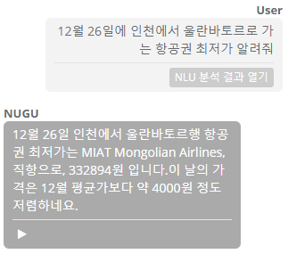
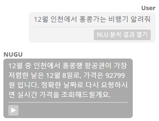
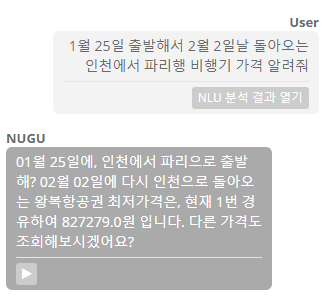
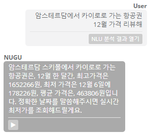

# (SKT NUGU AI project) nuguAir 백앤드 프록시 API

* 누구에어는 시시각각으로 변하는 항공권 가격을 음성만으로 실시간으로 조회하여 일상생활 속에서 항공권에 대한 제안과 리뷰를 제공함으로써 생활을 더욱 편리하고 쉽게 만들어주는 항공권 조회 Play입니다.

# SKT NUGU AI란?
- skt에서 개발한 인공지능 AI 스피커입니다.
- 소개영상

[](https://youtu.be/nqMT9OxMkyA=0s)

## 개발환경
* Eclipse Java EE IDE for Web Developers.(4.9.0)
* Spring Framework 3.1.1 RELEASE
* Jackson 2.8.11.1
* jdk 8

## HTML parser library
* jsoup 1.10.1

## Server
* raspberry3 tomcat8

## Controller
- MainController

항공권의 편도, 왕복, 리뷰, 월 리뷰에 대한 요청을 컨트롤하는 4가지의 컨트롤러로 구성되어 있습니다.
이곳에는 편도 요청에 대한 함수만 간단히 정리했습니다.
```
//편도 최저가 요청 컨트롤러입니다.
public String TicketPrice(@RequestBody JSONObject body) throws ParseException, IOException {
		
    System.out.println("NUGU에게서 편도 항공권 요청이 왔습니다.");

    NuguAir nuguAir = new NuguAir();
    SkyScanner sky = new SkyScanner();
    Calendar calendar = new Calendar();

    //Parsing request from NUGU
    if(nuguAir.NUGU_requestParsing_oneway(body)==-1) {
      return "";
    };

    //calculate date
    calendar.getNowDate();
    calendar.differDate(Integer.parseInt(nuguAir.getOrigin_month()));
    
    //zero mapping
    nuguAir.month_zeroMapping(nuguAir.getOrigin_month(),null,null,trip_type1);
    nuguAir.day_zeroMapping(nuguAir.getOrigin_day(),null,null,trip_type1);

    //get Parameters
    sky.getRequest(nuguAir.getOrigin_point(),oneway_origin);
    sky.getRequest(nuguAir.getDestination_point(),oneway_destination);

    //post Response
    sky.postRequest(trip_type1, calendar.getOut_year(),null,nuguAir.getOrigin_month(), nuguAir.getOrigin_day(),null,null);

    //json Parsing
    sky.domParsing();

    //find min price, max price, average price
    sky.getRequestToCalendar(calendar.getOut_year(),nuguAir.getOrigin_month());

    //response to NUTU
    JSONObject response = nuguAir.NUGU_response_oneway(sky);
    System.out.println("response : "+response);

    return response.toJSONString();
}
```
## Class
1. NuguAir
- request parsing (from nugu)
```
public int NUGU_requestParsing_oneway(JSONObject body) throws ParseException {
    //json parser
    JSONParser jsonParser = new JSONParser();
    try {
      //request parsing
      JSONObject bodyObj = (JSONObject) jsonParser.parse(body.toString());
      JSONObject actionObj = (JSONObject) jsonParser.parse(bodyObj.get("action").toString());

      JSONObject parametersObj = (JSONObject) jsonParser.parse(actionObj.get("parameters").toString());
      JSONObject origin_pointObj = (JSONObject) jsonParser.parse(parametersObj.get("origin_point").toString());
      JSONObject destination_pointObj = (JSONObject) jsonParser.parse(parametersObj.get("destination_point").toString());
      JSONObject monthObj = (JSONObject) jsonParser.parse(parametersObj.get("month").toString());
      JSONObject dayObj = (JSONObject) jsonParser.parse(parametersObj.get("day").toString());
      
      this.origin_point = origin_pointObj.get("value").toString();
      this.destination_point = destination_pointObj.get("value").toString();
      this.origin_month = monthObj.get("value").toString();
      this.origin_day = dayObj.get("value").toString();

    }catch(Exception e) {

      System.out.println("누구한테서 정보가 전부 안왔어요");
      return False;
    }
    return True;

  }
```
- response to nugu
```
@SuppressWarnings("unchecked")
public JSONObject NUGU_response_oneway(SkyScanner sky) {

    JSONObject key = new JSONObject();
    JSONObject response =  new JSONObject();

    key.put("destination", sky.getArr_PlaceName());
    key.put("origin", sky.getDep_PlaceName());
    key.put("origin_month", origin_month);
    key.put("origin_day", origin_day);
    key.put("total_min_price", (int)Double.parseDouble(sky.getTotal_min_price()));
    key.put("carrierName", sky.getCarrierName());
    key.put("via_inform", sky.getVia_inform());

    //string => parsing to double => casting to int
    int diff_min = (int)Double.parseDouble(sky.getTotal_min_price());
    int diff_average = sky.getReview_total_average_price();
    if(diff_min < diff_average) {
      key.put("oneway_ment", "이 날의 가격은 "+origin_month+"월 평균가보다 약 "+(diff_average-diff_min)/1000*1000+"원 정도 저렴하네요.");
    }else {
      key.put("oneway_ment", "이 날의 가격은 "+origin_month+"월 평균가보다 약 "+(diff_min - diff_average)/1000*1000+"원 정도 비싸네요.");
    }

    response.put("resultCode", "OK");
    response.put("version", "2.0");
    response.put("output", key);

    return response;
}
```
2. SkyScanner

- post, get 요청을 통해 각종 항공권 정보를 얻어옵니다.

3. Calendar

- 현재 날짜를 구합니다.
```
public void getNowDate() {
    Date currentTime = new Date ();
    System.out.println(currentTime);
    this.nowYear = Integer.parseInt(mSimpleDateFormat_year.format ( currentTime ));
    this.nowMonth = Integer.parseInt(mSimpleDateFormat_month.format ( currentTime ));
}
```


## 실행 결과

### 1. 편도 항공권 최저가 조회

1-1. 날짜를 모두 발화했을 경우



1-2. 월만 발화했을 경우



### 2. 왕복 항공권 최저가 조회



### 3. 특정 날짜 항공권 리뷰


